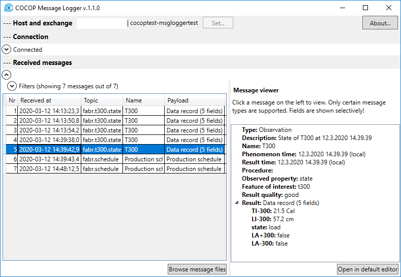

COCOP Message Logger v.1.1
==========================

---


COCOP - Coordinating Optimisation of Complex Industrial Processes  
https://cocop-spire.eu/

This project has received funding from the European Union's Horizon 2020 research and innovation programme under grant agreement No 723661. This piece of software reflects only the authors' views, and the Commission is not responsible for any use that may be made of the information contained therein.

---


Authors
-------

Petri Kannisto, Tampere University, Finland  
https://github.com/kannisto  
http://kannisto.org

Tapio Vaaranmaa, Tampere University, Finland  
t*.v* at gmail.com (replace t* and v* with respective names)

**Please make sure to read and understand [LICENSE.txt](./LICENSE.txt)!**


COCOP Toolkit
-------------

This application is a part of COCOP Toolkit, which was developed to enable a decoupled and well-scalable architecture in industrial systems. Please see https://kannisto.github.io/Cocop-Toolkit/


Introduction
------------

This sofware application was created as a part of the research project COCOP. The purpose is to log messages from an AMQP message bus (RabbitMQ, in particular). The messages are stored in the hard disk, and related metadata enables the user to search for logged messages. Any messages can be logged, and certain message types can be visualised in a treeview. These types are the ones commonly exchanged in COCOP project.



This repository contains the following applications:

* AmqpDataSourceForTest: Application to send data over AMQP to enable the testing of the application
* CocopMessageLogger: The actual message logger application
* LoggerTest: Application to test the logger class
* MessageMetadataTest: Tests the management of metadata
* MetadataExtractorTest: Tests metadata extraction from received messages
* TimeWindowBuilderTest: Tests the TimeWindowBuilder class

See also:

* Github repo: https://github.com/kannisto/Cocop.MessageLogger


Environment and Libraries
-------------------------

The development environment was _Microsoft Visual Studio 2017 (Version 15.8.2)_.

The .NET Framework version is the ancient 4.5.1. This was chosen to reduce the risk that a deployment environment does not have a version new enough.

This distribution does not include any external libraries. These are the following:

* RabbitMQ.Client 4.1.3
  * nuget: ```Install-Package RabbitMQ.Client -Version 4.1.3```
* EntityFramework.6.4.0
* SQLite
  * System.Data.SQLite.1.0.112.0
  * System.Data.SQLite.Core.1.0.112.0
  * System.Data.SQLite.EF6.1.0.112.0
  * System.Data.SQLite.Linq.1.0.112.0
* Cocop.MessageSerialiser.Meas 2.0.0
  * Please see https://github.com/kannisto/Cocop.MessageSerialiser.Meas_csharp
* Cocop.MessageSerialiser.Biz 2.0.0
  * Please see https://github.com/kannisto/Cocop.MessageSerialiser.Biz_csharp
